The interactive menu is a persistent TUI shell (`internal/tui/app`): a stack
of screens with a breadcrumb header, contextual footer, and a command palette.
This page maps the current flows and how they are tested.

## Navigation model

| Key | Action |
|-----|--------|
| `↑↓` / `j k` | move cursor |
| `enter` / `→` / `l` | select / drill in |
| `esc` / `←` / `backspace` / `h` | back (quits at root) |
| `/` | fuzzy-filter the current menu |
| `ctrl+p` | command palette (fuzzy search over every action) |
| `?` | help overlay |
| `g` / `G` | first / last item |
| `q` / `ctrl+c` | quit |

## Menu tree

All flows render natively inside the shell. (Historical note: items once
the shell resumes) — they are candidates for native-screen migration.

```mermaid
graph TD
    Home[Home] --> Status["📊 Status (native scrollable view)"]
    Home --> Doctor["🩺 Doctor (native diagnostics, --fix/--bench via CLI)"]
    Home --> Terminal["👻 Terminal Setup (Ghostty/WezTerm: install, Dock pin, themed config)"]
    Home --> Shell[🐚 Bluefin Shell]
    Home --> Install[📦 Install Apps]
    Home --> Wallpapers["🖼 Wallpapers (install collections + set wallpaper on macOS/GNOME/Windows)"]
    Home --> Fonts["🔤 Fonts (native multiselect)"]
    Home --> Starship["🚀 Starship Theme (native select)"]
    Home --> Sunset["🌇 Sunset Switching (plus build, WSL/Windows only)"]
    Home --> Exit[👋 Exit]

    Shell --> Toggle["🔄 Toggle current shell (auto-detected)"]
    Shell --> Components["🔧 Configure Components (native multiselect)"]
    Shell --> MOTD["📰 MOTD Settings (native menu)"]
    Shell --> Shells["🐚 Other Shells (native multiselect)"]
    Shell --> Advanced["🎨 Advanced (native: dark mode, flavor)"]

    Install --> AI["🤖 AI Tools"]
    Install --> CLI["💻 CLI Essentials"]
    Install --> CNCF["🌐 CNCF Tools"]
    Install --> XIDE["🧪 Experimental IDE"]
    Install --> IDE["📝 IDE Tools"]
    Install --> K8s["🎡 Kubernetes Tools"]
    Install --> Gnome["🐧 Full GNOME Desktop (Linux+GNOME only)"]

    AI --> Pkg["Per-category package multiselect (native):\ninstalled pre-checked, diff → confirm → runner"]
    Install --> MyBrew["🏠 My Brewfile: install all, manage, add via\ncross-manager search, remove, dump"]
```

The `ctrl+p` palette lists every leaf destination above (Status, each install
category, Wallpapers, Fonts, Starship, Sunset) — one fuzzy search reaches
anything in the tree.

## How this is tested

Three layers, run by CI and `just` recipes:

1. **Model tests** (`internal/tui/app/app_test.go`): synchronous, deterministic
   tests of navigation state — push/pop, cursor movement, filtering, palette,
   help overlay — plus a direct render assertion on the composed frame.
2. **Menu wiring tests** (`cmd/menu_test.go`): every menu item and bundle
   category must resolve to an action, so a menu entry can never silently lead
   nowhere.
3. **End-to-end smoke** (`scripts/tui-smoke.sh`, `just tui-smoke`): drives the
   real binary in a tmux pane — sends actual keystrokes, captures the screen,
   and asserts rendering, drill-down, filter, palette, help, and quit.

## Native screens & extras

- Every flow renders natively inside the shell: selection UIs are
  `app.FormScreen`, read-only views are `app.TextScreen`, and printing tasks
  (brew installs, MOTD, doctor) run in `app.RunnerScreen`, which captures
  their stdout into a scrolling log with a spinner and elapsed time. The only
  terminal handover left is the WSL→Windows sunset delegation
  (`app.RunExternal`), which launches another interactive program.
- `bluefin-cli doctor` — environment diagnostics with fix hints.
- `bluefin-cli theme <flavor>` — pin a Catppuccin flavor (latte, frappe,
  macchiato, mocha) or `auto` to follow the terminal background.
- `bluefin-cli update` — self-update for script installs, now verified
  against the release's `checksums.txt`; the menu also checks for updates in
  the background and shows a toast.
- 🦕 **Dino Run** — hidden runner mini-game on the half-block pixel canvas:
  `ctrl+p` → "Dino Run", or the hidden `bluefin-cli dino` command. Space
  jumps kelp, stay down under fish; high score persists.
- 👻 **Terminal Setup** — install the platform's best terminal (Ghostty on
  macOS/Linux via brew, WezTerm on Windows via winget), pin to the macOS
  Dock, and write a Catppuccin auto light/dark config with your Nerd Font.
- 🏠 **My Brewfile** — one package file for every OS (brew/cask +
  winget/scoop/choco): dump from installed, search-to-add across managers,
  remove entries, install everything. Also `bluefin-cli brewfile`.
- 📦 **Profiles** — `profile export/import/diff/push/pull` replay a whole
  setup (shells, tools, flavor) across machines, synced via a private gist.
