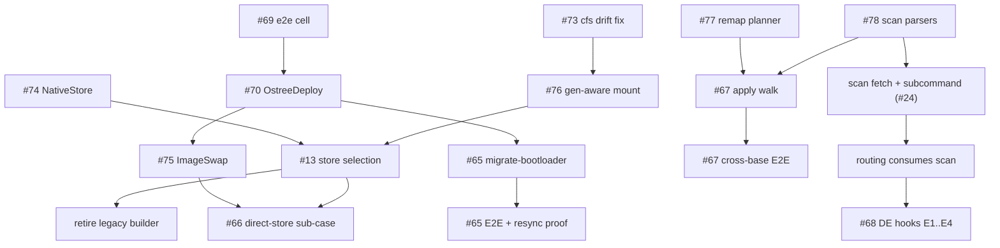

Status date: 2026-07-19. Living document; the issue tracker is authoritative
for day-to-day state, this file is authoritative for **shape and sequence**.

## Vision

One engine that moves a bootc system between **images, backends, bootloaders,
base families, and desktops** — safely, with a staged+rollback contract, and
with the same evidence-first discipline at every step: report before acting,
verify after acting, keep the previous state bootable.

Three deliverables share the code:

| Deliverable | What it is | Stability contract |
|---|---|---|
| `bootc-migrate-composefs` | The proven OSTree→ComposeFS migrator (**protected MVP**) | CLI surface, output, and behavior frozen; its four E2E cells are untouchable regression gates |
| `bootc-migrate-core` | The capability library: phases, preflight, /etc merge, transaction, registry streaming, stores, scan, remap | Additive growth; everything new lands here first |
| `bootc-rebase` | The universal CLI: routing table × strategies | Where new user-facing capability ships |

## Where we are

**Done and merged**: RFC #45 library carve-out (workspace, phase modules,
preflight/readiness, transaction, `ComposefsStore` trait, `bootc-rebase`
scaffold + routing table, core-migration route) — PRs #53–#62. Upstream cfs
CLI drift (#72) survived via probe + delegation + pinned legacy builder
(commit-level fix on PR #73).

**In flight** (all locally verified; awaiting E2E gates):

```
main ← #73 cfs-drift fix ← #76 generation-aware mount (phases 4/5)
main ← #69 ostree-rebase E2E cell ← #70 OstreeDeploy ← #75 ImageSwap
main ← #71 docs (CONTEXT.md, cfs-cli-generations.md, this file)
main ← #74 NativeStore (composefs-native feature)      [independent]
main ← #77 UID/GID remap planner (#67 part 1)          [independent]
main ← #78 capability-scan parsers (#24)               [independent]
```

Merge order: #73 → #69 → #70, then the stacked children retarget; the four
independents merge any time their gates pass.

## Milestones

### M0 — MVP hardening (continuous; protects everything else)

The migrator must stay boringly reliable while capability work happens
around it.

- #72 → resolved by #73/#76 short-term, #13 long-term (close when merged)
- #22 E2E rollback test + README recovery section
- #26 `rollback` subcommand (automate return to OSTree)
- #25 `commit` produces layout identical to fresh install
- #17 post-migration cleanup of OSTree-only /var paths
- #27 systemd sleep inhibitor during migration
- #18 E2E: pre-baked SSH image, drop runtime injection (CI reliability)
- #12 finish phase-module unit tests (largely done by carve-out; audit + close)
- #29 Containerfile-based initrd patching (LVM+XFS+loopback approach B — keep
  as recorded alternative; activate only if the current initrd path breaks)

**Exit criteria**: rollback proven in CI; commit/undo produce
indistinguishable-from-fresh layouts; no known MVP flakes.

### M1 — Same-backend re-base engine (scenarios A / A′) — *nearly done*

- #63 ostree-rebase E2E cell (PR #69) — gate for the strategy work
- #64 `Strategy::OstreeDeploy` (PR #70)
- #66 `Strategy::ImageSwap` switch-path (PR #75); direct-store sub-case moves to M4
- #24 capability scan: parsers landed (PR #78); remaining: registry fetch
  wiring for `ProbeFiles` + `bootc-rebase scan` subcommand + routing consumption

**Exit criteria**: `bootc-rebase --plan` truthfully answers all four
backend-pair routes; ostree→ostree proven by its own E2E cell; scan output
drives route refusal with evidence.

### M2 — Bootloader migration (scenario B)

- #65 `migrate-bootloader` GRUB2→systemd-boot: ESP-copy + kernel-install /
  path-unit resync hook + BootNext one-boot trial (spec on issue; XBOOTLDR
  ruled out by audit)
- Integration into OstreeDeploy route when readiness allows (#64 decision:
  migrate when ready)
- E2E: extend the #63 cell with `--bootloader systemd-boot` + a simulated
  kernel update asserting ESP resync

**Exit criteria**: a GRUB2 bluefin VM re-bases, boots via sd-boot, survives a
kernel update, and `--undo` restores GRUB cleanly.

### M3 — Cross-base re-base (scenario C)

- #67 part 1 (remap planner) in PR #77; part 2: apply walk over /var +
  preserved /etc in the staged deployment; part 3: mergetc cross-base mode
  (target defaults + `.rebase-old` sidecars); gate via `is_cross_base`
  (landed in PR #78) + `--accept-cross-base`
- Uses #24 scan for target passwd/group/sysusers without a pull

**Exit criteria**: fedora-family → centos-family E2E cell with a populated
/var: correct ownership after reboot, report lists every renumbered account,
`.rebase-old` sidecars present where defaults were taken.

### M4 — Native store & the generation matrix (the #72 endgame)

- #13 `NativeStore` (PR #74) + store **selection** by target generation;
  generation-aware mount (PR #76) already restores phase-4/5 overlay mounts
- Retire the pinned legacy builder once selection lands (the builder is a
  bridge, not a destination)
- E2E cell exercising a NativeStore-written store end-to-end
- Evidence base: `docs/cfs-cli-generations.md` (compatibility matrix,
  in-place upgrade, deterministic EROFS ids)

**Exit criteria**: migration succeeds with *no* legacy-CLI bootc anywhere
(host, target, builder); `BMC_CFS_BUILDER` becomes a no-op escape hatch.

### M5 — Desktop & UX (scenario E + human factors)

- #68 DE hooks: E1 stash (per-DE inventory from the Mending Wall model) →
  E2 restore unit + menu dedup → E3 flatpak swap plan/apply → E4 hook
  contract for image maintainers (spec on issue, research recorded)
- #15 pre-migration /etc drift review (interactive diff)
- #31 TUI/GUI boot-entry cleanup + distro branding

**Exit criteria**: bluefin↔aurora-style switch preserves user data
untouched, stashes/restores DE state, swaps DE-scoped flatpaks on request;
non-experts can read what will happen before it happens.

### 1.0 — Universal migrator

All routes in the table implemented or explicitly refused with evidence;
MVP binary either retired into `bootc-rebase --target-backend composefs`
or kept as a thin alias; docs complete (architecture, generations,
recovery, hooks). Version and deprecation policy published.

## Dependency graph



## Risks & standing mitigations

- **Upstream drift is the norm, not the exception.** bootc replaced its cfs
  CLI once mid-project; assume it will again. Mitigation: the generation
  matrix (probe, delegate, native), pinned-builder escape hatch, and the
  empirical harness in docs/cfs-cli-generations.md to re-verify fast.
- **MVP regression via shared code.** Mitigation: MVP protection rule
  (frozen behavior, additive-only in core, probe-gated divergence), four
  untouchable E2E cells.
- **CI capacity** (runner starvation observed 2026-07-19). Mitigation:
  everything is verified locally before push; heavy validation designed as
  unit/loopback experiments where possible; E2E cells narrow and
  dispatchable individually.
- **Settings translation temptation (#68).** Prior art is unanimous that
  GNOME↔KDE translation fails; the spec forbids it. Stash/restore only.

## Decision log (summary — details in issues)

- Bootloader on ostree→ostree: migrate to systemd-boot **when ready** (#64)
- UID/GID divergence: **auto-remap with report** (#67)
- Cross-base /etc conflicts: **target defaults win**, user value kept as
  `.rebase-old` sidecar (#67)
- Store format is defined by the **reader at boot** (target image) — writer
  selection follows the target's generation (#13/#72)
- XBOOTLDR GUID-retype: **dead** (sd-boot ≥258.2 requires vfat) — ESP-copy
  + resync instead (#65)
- DE settings: **stash/restore, never translate** (#68)
