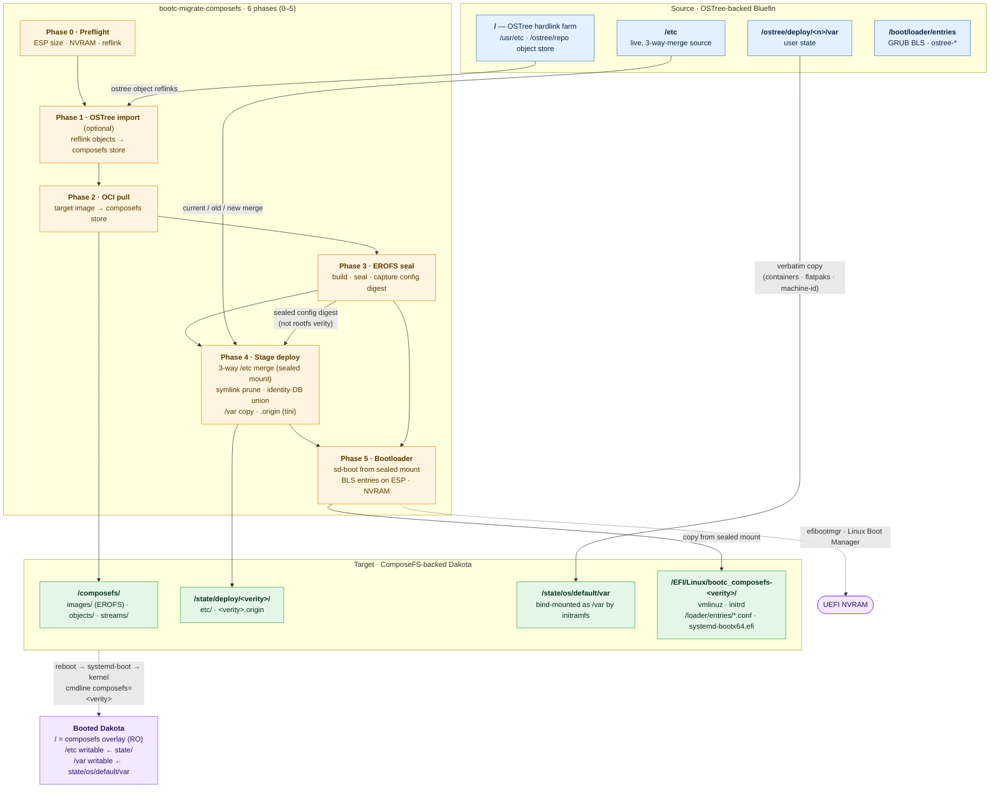

[](https://github.com/tuna-os/bootc-migrate-composefs/actions/workflows/ci.yml)
[](https://github.com/tuna-os/bootc-migrate-composefs/actions/workflows/e2e-tests.yml?query=branch%3Amain)

In-place migration utility that converts an OSTree-backend bootc system
(e.g. Bluefin) into a ComposeFS-backend bootc system (e.g. Dakota), without
reinstalling and without losing `/home`, `/var`, `/etc` customizations,
flatpaks, container storage, or user accounts.

## Migrate Bluefin → Dakota (quick start)

The common case: **Bluefin stable (btrfs) → Dakota stable**. Five steps. Your
old OSTree deployment stays in the boot menu as a fallback the whole time.

> ⚠️ **Back up anything you can't afford to lose first.** This rewrites how your
> system boots. It preserves `/home`, `/var`, `/etc`, flatpaks, container
> storage, and user accounts — but treat it as risky until you've rebooted and
> confirmed everything works. It's reversible until you run `commit` (step 5).

**1. Get the migrator.** Download the latest prebuilt binary (x86_64; for arm64
swap in `aarch64-unknown-linux-gnu`):

```bash
curl -fsSL -o bmc.tar.gz \
  https://github.com/tuna-os/bootc-migrate-composefs/releases/latest/download/bootc-migrate-composefs-x86_64-unknown-linux-gnu.tar.gz
tar xzf bmc.tar.gz
sudo install -m755 bootc-migrate-composefs /usr/local/bin/
```

<details><summary>…or pull the container image</summary>

A minimal image ships the same binary, useful when GitHub Releases is rate-limited/blocked, or to `COPY --from=` it into another Containerfile:

```bash
podman create --name bmc-extract ghcr.io/tuna-os/bootc-migrate-composefs:latest
podman cp bmc-extract:/usr/local/bin/bootc-migrate-composefs .
podman rm bmc-extract
sudo install -m755 bootc-migrate-composefs /usr/local/bin/
```
</details>

<details><summary>…or build from source (needs Rust)</summary>

```bash
git clone https://github.com/tuna-os/bootc-migrate-composefs
cd bootc-migrate-composefs
cargo build --release
sudo install -m755 target/release/bootc-migrate-composefs /usr/local/bin/
```
</details>

**2. Dry-run** — makes no changes, just checks your system is ready:

```bash
sudo bootc-migrate-composefs \
  --target-image ghcr.io/projectbluefin/dakota:stable --dry-run
```

**3. Migrate** (~5–25 min depending on cache/network):

```bash
sudo bootc-migrate-composefs \
  --target-image ghcr.io/projectbluefin/dakota:stable
```

**4. Reboot** — the new composefs entry is the default. If anything looks wrong,
pick the old **Bluefin / OSTree** entry in the boot menu to get straight back.

```bash
sudo systemctl reboot
```

**5. Confirm, then make it permanent:**

```bash
cat /proc/cmdline | grep -o 'composefs=[0-9a-f]*'   # confirms composefs boot
sudo bootc-migrate-composefs commit                 # one-way; removes the OSTree fallback
```

> ⚠️ **Note:** Phase 4 copies `/var` to the composefs side. After migration,
> the two `/var` trees are **independent** — changes you make on the composefs
> side won't be reflected if you roll back to OSTree (and vice versa). Commit
> only when you're satisfied with the new system.

That's it. For flags, rollback, troubleshooting, and the full phase-by-phase
breakdown, see [Usage — end-to-end walkthrough](#usage--end-to-end-walkthrough).
On **Bluefin LTS** (XFS) or systems with **LVM / LUKS / a dedicated `/var`
partition**, the tool handles those automatically — see
[docs/filesystem-support.md](https://github.com/tuna-os/bootc-migrate-composefs/blob/main/docs/filesystem-support.md).

> **Status: CI-validated, released, and proven on real hardware.** Four E2E
> scenarios — btrfs, ext4, LUKS+XFS, and LVM-on-LUKS with a dedicated `/var` —
> run in CI on every push to `main` (migration, commit, deep-clean, and
> `bootc status` / `upgrade --check` all green). Prebuilt binaries are on the
> [Releases](../../releases) page. Don't point this at a machine you can't
> reinstall, but the core path is stable.

## Interactive wizard (TUI)

Prefer a guided walkthrough over flags? Run the tool with no `--target-image`
(or `tui` explicitly) to launch a terminal wizard that walks through target
image selection, options, a plain-English review of what's about to happen,
and a live phase-by-phase progress view with scrollable logs:

```bash
sudo bootc-migrate-composefs tui
```


The wizard defaults to `--dry-run` and only builds the equivalent CLI
invocation shown on the Review screen — it doesn't need root just to browse;
root is required once you press Enter to actually run a migration.

## Architecture



**Key insight:** Phase 3 runs `bootc internals cfs oci seal` which prints the
sealed manifest's config digest. Phases 4 and 5 pass that **sealed config
digest** (not the rootfs verity) to `bootc cfs oci mount` — the overlay then
exposes real file content for `/etc`, kernel, initrd, systemd-boot, and kernel
modules, eliminating the need to re-stream OCI layers at runtime.

## What it does

Six phases (numbered 0–5 to match the console output), run as one command:

- **Phase 0 — Preflight** — free-space, reflink/CoW, UEFI, NVRAM-writable, ESP
  capacity.
- **Phase 1 — OSTree import** *(optional)* — reflinks existing OSTree file
  objects into the composefs object store so the pull in Phase 2 is mostly
  dedup. Skipped with `--skip-import`.
- **Phase 2 — OCI pull** — `bootc internals cfs oci pull` of the target bootc
  image into the composefs store.
- **Phase 3 — EROFS seal** — builds and seals the EROFS image, capturing the
  sealed config digest that Phases 4 and 5 mount.
- **Phase 4 — Stage deploy** — 3-way `/etc` merge (read from the sealed mount,
  no registry streaming), identity-DB line-union, dangling `/usr/*` symlink
  pruning, `/var` data copy into `state/os/default/var`, and `.origin`
  (boot_digest, manifest_digest) written via tini.
- **Phase 5 — Bootloader** — copies `systemd-bootx64.efi` from the sealed mount
  to the ESP (no registry streaming), writes BLS entries, and registers
  `Linux Boot Manager` in UEFI NVRAM. The original GRUB entry is left as a
  rollback escape hatch.

After a successful reboot into the composefs entry, `bootc-migrate-composefs
commit` removes the OSTree fallback and makes composefs permanent.

## Usage — end-to-end walkthrough

> **Before you start.** This tool rewrites bootloader state and copies the
> entire `/var`. Don't run it on a machine you can't reinstall in a pinch.
> Until you run `commit`, it's reversible — but a fresh backup is still
> cheap insurance.

### 1. Decide your target

The migration takes a `--target-image` — the composefs-backed bootc image
you want to end up on. Today the validated path is **Bluefin → Dakota**:

```
ghcr.io/projectbluefin/dakota:stable     # default target
```

If you're migrating a different OSTree-backed system (Aurora, Silverblue),
point `--target-image` at the composefs-flavored equivalent.

### 2. Check readiness with a dry-run

```bash
sudo bootc-migrate-composefs \
  --target-image ghcr.io/projectbluefin/dakota:stable \
  --dry-run
```

Things to confirm in the report:

- `Booted OSTree backend: Yes` — required; if `No` the tool refuses to run.
- `UEFI Boot Mode: Yes` + `NVRAM writable: Yes` — required for the
  systemd-boot path; on BIOS-only or locked NVRAM pass `--bootloader grub2`.
- `ESP Free Space: ≥ 150 MB` — we copy `systemd-bootx64.efi` from the
  target image onto the ESP.
- `Reflink (CoW) Support: Yes` — btrfs and XFS both support reflink.
- `ComposeFS free space: ≥ 1.1 × ostree_repo_size` — the composefs object
  store is built by reflinking your existing OSTree objects.

### 3. Run the migration

```bash
sudo bootc-migrate-composefs \
  --target-image ghcr.io/projectbluefin/dakota:stable
```

Expect ~5–10 minutes on warm caches, ~15–25 minutes on a cold pull. Six
phase headers (0–5) print as it goes:

| Phase | What's happening | Why it might take a while |
|---|---|---|
| **0 — Preflight** | Same checks as `--dry-run` | seconds |
| **1 — OSTree import** *(optional)* | Reflinks existing OSTree file objects into the composefs object store so Phase 2 mostly dedups | tens of seconds to a few minutes; skip with `--skip-import` |
| **2 — OCI pull** | `bootc internals cfs oci pull` of the target image | minutes (network-bound) |
| **3 — EROFS image** | Builds + fs-verity-signs the composefs metadata image | seconds |
| **4 — Stage deploy** | 3-way `/etc` merge (from sealed mount), dangling-symlink prune, identity-DB line-union, `/var` copy to `state/os/default/var`, `.origin` file written | ~1 minute |
| **5 — Bootloader** | Copies systemd-boot from mounted image, writes BLS entries, registers NVRAM | ~30s |

When it ends with `=== MIGRATION COMPLETED ===` the on-disk state is
ready. Reboot:

```bash
sudo systemctl reboot
```

### 4. Validate the composefs boot

Log in (your existing accounts and SSH keys still work) and check:

```bash
cat /proc/cmdline                                       # must contain composefs=<hex>
bootc status                                            # should report the composefs deployment
bootc status --json | jq .status.booted.composefs        # non-null
```

Spend a day on it. Run your usual workflow — flatpaks, dnf, containers,
homebrew, GNOME extensions, whatever. Everything that lived under `/home`,
`/var`, and `/etc` on Bluefin should be where you left it. If something
is missing or broken, you can roll back (see below).

A login banner (`/etc/motd.d/85-bootc-migrate-composefs`) reminds you to run
`commit` on every login until you do, so a live migration doesn't sit
forgotten in this dual-boot state indefinitely. It clears itself once
`commit` runs — or once `undo` runs, since at that point there's nothing
left to commit.

### 5. Make it permanent (one-way)

Once you trust the new system:

```bash
sudo bootc-migrate-composefs commit
```

This removes the OSTree fallback from the ESP, drops GRUB2 boot artifacts,
and reclaims ~14 GiB of OSTree object store. The systemd-boot entry becomes
the sole default with timeout 0.

### Flags

| Flag                  | Purpose                                                            |
| --------------------- | ------------------------------------------------------------------ |
| `--dry-run`           | Print every action; touch nothing                                  |
| `--skip-import`       | Skip phase 1 (faster when target image is mostly new content)      |
| `--bootloader grub2`  | Stay on GRUB2 instead of installing systemd-boot                   |
| `--skip-preflight`    | Bypass preflight checks (don't, unless you know exactly why)       |
| `--force`             | Proceed past non-fatal warnings                                    |

### Rollback / recovery

Until you run `commit`, the migration is **reversible**. The previous OSTree
deployment stays bootable:

- Phase 5 only *adds* the systemd-boot composefs entry; it never deletes the
  existing `/boot/loader/entries/ostree-*.conf` files.
- The original `/ostree/deploy/<n>/deploy/<commit>.0/` rootfs and
  `/ostree/deploy/<n>/var/` stay on disk.
- Phase 4 *copies* `/var` to `state/os/default/var`; the OSTree side's `/var`
  is independent of the composefs side's after migration.
- We push `Linux Boot Manager` (systemd-boot) to the front of NVRAM `BootOrder`
  but the `Fedora` shim entry (which boots GRUB → OSTree) remains listed.

#### Automatic rollback subcommand

To return to the original OSTree deployment directly from the command line:

```bash
sudo bootc-migrate-composefs rollback --reboot
# or via the universal re-base CLI:
sudo bootc-rebase rollback --reboot
```

This verifies prerequisites, re-orders UEFI `BootOrder` so the OSTree entry (Fedora/GRUB) takes top priority, and reboots immediately into the OSTree deployment.

#### Manual firmware recovery

If the system fails to boot into composefs or NVRAM state is interrupted:

1. Power on; tap the firmware boot-menu key (commonly **F12**, **F8**, or **Esc**).
2. Pick the `Fedora` entry. GRUB will show the original `ostree:0` menu.
3. Boot it. You land on the pre-migration system with its `/var` and `/etc` intact.

Or, from a working composefs login, one-shot:

```bash
sudo efibootmgr -v | grep -E 'Fedora|Linux Boot Manager'
sudo efibootmgr --bootnext <Boot####-of-Fedora>
sudo systemctl reboot
```

Pre-migration diagnostic snapshots and logs are automatically recorded under `/var/log/bootc-migrate-composefs/` on every run (`preflight-*.json` and `migration.log`) so boot configuration can be manually reconstructed if NVRAM is ever wiped.

After running `bootc-migrate-composefs commit`, the OSTree fallback is removed
from the ESP and rollback becomes a fresh install. The E2E test exercises the
full round-trip (composefs → OSTree → composefs) on every run.

### What's preserved

Validated end-to-end (21+ assertions per run; see `tests/run-e2e.sh`):

- **/var data** — `/var/lib/*`, `/var/log/*`, `/var/cache/*`, containers,
  flatpak system installs, machine-id, hidden dirs and symlinks
- **User homes** — `/var/home/<user>/`, dotfiles, project trees, SSH keys
  (with `.ssh` mode preserved so StrictModes still accepts your keys),
  wallpapers, GNOME extensions, dconf user db, glib gsettings keyfile,
  homebrew Cellar, per-user flatpak installs
- **/etc state** — `/etc/sudoers.d/*`, `/etc/hosts` edits, custom
  `sshd_config.d/*`, custom config files added under `/etc/`, in-place
  edits to image-shipped files (`/etc/hostname`), `/etc` symlinks
- **Accounts** — `/etc/passwd`, `/etc/shadow`, `/etc/group` line-union
  merged so users you added survive *and* users the target image needs
  (messagebus, polkitd, …) get added

What's intentionally *not* carried forward:

- OSTree/rpm-ostree state markers (`.updated`, `.rpm-ostree-shadow-mode-fixed2.stamp`)
- GRUB2 config files (`grub2.cfg`, `grub2-efi.cfg`, `/etc/grub.d/`) — the
  target uses systemd-boot
- Source-image `/etc` files the target image removed (e.g. `sshd_config.d/40-redhat-crypto-policies.conf`
  which references `/etc/crypto-policies/` paths Dakota doesn't ship)

### Troubleshooting

| Symptom | Likely cause | Fix |
|---|---|---|
| Phase 0 refuses with "System is not booted into an OSTree deployment" | You're already on composefs (or a non-bootc system) | Nothing to do |
| Phase 2 fails with ENOSPC mid-pull | `/sysroot/composefs` is tight on the 1.1× heuristic | Free space or grow the partition, then rerun |
| Post-reboot `cat /proc/cmdline` shows `ostree=` not `composefs=` | Firmware ignored the new NVRAM entry, or OVMF loaded `Fedora\shim` instead | Use firmware boot menu to pick `Linux Boot Manager`; if that fails, fall back to OSTree and report the firmware quirk |
| `bootc status` says "No manifest_digest in origin" | You're on an old build of this tool | Update to `main` — version info is on the first line of the migration log |
| SSH key auth broken post-migration | Permissions changed during /var copy | Boot OSTree fallback and `chmod 700 ~/.ssh; chmod 600 ~/.ssh/authorized_keys` |
| GNOME boots but session settings (wallpaper, accent) look wrong | dconf database needs recompile | `dconf update` as your user, or log out + back in |
| Migration went wrong and you want to undo it | Something failed mid-migration | Run `sudo bootc-migrate-composefs undo` (removes composefs boot artifacts, keeps object store) or `sudo bootc-migrate-composefs undo --full` (full cleanup including object store); then reboot into OSTree |

## Requirements

- Booted on an OSTree-backed bootc system (Bluefin, Aurora, Silverblue…)
- UEFI firmware with writable NVRAM (for the systemd-boot path; GRUB2 fallback
  works on BIOS)
- Btrfs or XFS sysroot with reflink/CoW support
- ESP with ≥150 MB free
- ≥ `1.1 × ostree_repo_size` free on `/sysroot/composefs` (no reflink: 1.5×)
- Outbound registry access for `bootc internals cfs oci pull`
  (Phase 2 fetches the target image; Phases 4–5 read artifacts from the sealed
  mount, so no runtime registry access is needed after Phase 2)

## Building

```
cargo build --release
```

Drops a single binary at `target/release/bootc-migrate-composefs`.
Requires Rust 1.85+ and a Linux host with `libxkbcommon-dev`.

## End-to-end tests

A QEMU-based E2E harness lives in `tests/run-e2e.sh`. It installs Bluefin
into a disk image, runs the migration against a registry mirror of the
Dakota target image, reboots, and validates the full round-trip.

```
sudo ./tests/run-e2e.sh
```

Overridable via env: `BASE_IMAGE`, `TARGET_IMAGE`, `DISK_SIZE`,
`FILESYSTEM`, `SKIP_SETUP`. The CI matrix runs four scenarios: btrfs (default), XFS+ext4-loopback, LUKS+XFS+crypt,
and LVM-on-LUKS with a dedicated `/var`.

## Layout

- `src/main.rs` — CLI surface (clap), `commit` and `undo` subcommands
- `src/preflight.rs` — environment validation
- `src/migration/mod.rs` — five-phase orchestrator (monolithic; uses rustix)
- `src/composefs.rs` — wraps `bootc internals cfs`
- `src/ostree.rs` — OSTree object scan + reflink import
- `src/mergetc.rs` — 3-way `/etc` merge
- `src/migration/bootloader.rs` — BLS entry generation (systemd-boot + GRUB2)
- `src/migration/esp.rs` — ESP device detection, auto-mount, efibootmgr
- `src/migration/phases.rs` — phase-specific helpers (registry extraction,
  initrd rebuild, kernel modules)
- `tests/run-e2e.sh` — QEMU E2E harness

## Contributing

Contributions are welcome — see [CONTRIBUTING.md](https://github.com/tuna-os/bootc-migrate-composefs/blob/main/CONTRIBUTING.md) for setup and
[REVIEW.md](https://github.com/tuna-os/bootc-migrate-composefs/blob/main/REVIEW.md) for the code-review expectations. Run `just check` (clippy,
rustfmt, unit tests, shellcheck) before opening a PR. AI-assisted contributions
should follow [AGENTS.md](https://github.com/tuna-os/bootc-migrate-composefs/blob/main/AGENTS.md).

## License

Licensed under either of [Apache License, Version 2.0](LICENSE-APACHE) or
[MIT license](LICENSE-MIT) at your option.

Unless you explicitly state otherwise, any contribution intentionally submitted
for inclusion in this project by you, as defined in the Apache-2.0 license, shall
be dual-licensed as above, without any additional terms or conditions.
