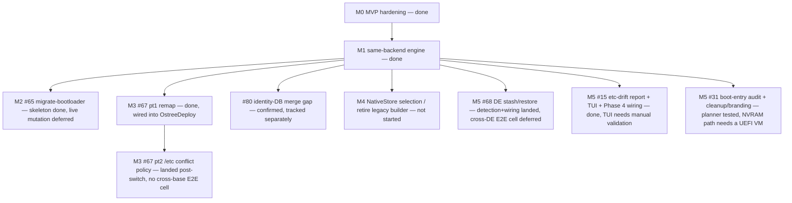

Status date: 2026-08-13. Living document; the issue tracker is authoritative
for day-to-day state, this file is authoritative for **shape and sequence**.

## Vision

One engine that moves a bootc system between **images, backends, bootloaders,
base families, and desktops** — safely, with a staged+rollback contract, and
with the same evidence-first discipline at every step: report before acting,
verify after acting, keep the previous state bootable.

Three deliverables share the code:

| Deliverable | What it is | Stability contract |
|---|---|---|
| `bootc-migrate` | The proven OSTree→ComposeFS migrator (**protected MVP**) | CLI surface, output, and behavior frozen; its four E2E cells are untouchable regression gates |
| `bootc-migrate-core` | The capability library: phases, preflight, /etc merge, transaction, registry streaming, stores, scan, remap, boot audit, DE stash/restore | Additive growth; everything new lands here first |
| `bootc-rebase` | The universal CLI: routing table × strategies | Where new user-facing capability ships |

## Where we are

**M0 (MVP hardening) and M1 (same-backend re-base engine) are done.** Every
issue under both milestones is closed. `bootc-rebase` truthfully routes all
four backend pairs (implemented for three of them; `composefs→ostree` remains
explicitly refused, not silently attempted) and the capability scan (#24)
covers every proposed probe.

**In progress, with an explicit boundary between what's landed and what's
deliberately deferred** — each of M2, M3, and M5 shipped a pure/unit-testable
"skeleton" slice first. M2 stopped there, ahead of boot-critical live-system
mutation CI cannot validate; M3 and M5 have since grown their live halves,
but those run on paths no CI cell reaches (no cross-base E2E cell, no NVRAM
mutation, no TUI assertions), so they are landed-but-unproven rather than
done. See each milestone below for the specific line and why.

## Milestones

### M0 — MVP hardening (continuous; protects everything else) — **done**

All exit-criteria issues closed: #72 (cfs CLI drift, resolved short-term by
probe+delegation, long-term by #13's `NativeStore`), #22 (E2E rollback proof),
#26 (`rollback` subcommand), #25 (`commit` verified fresh-install-identical),
#17 (post-migration `/var` cleanup), #27 (sleep inhibitor), #18 (pre-baked SSH
E2E image), #12 (phase-module unit tests), #29 (Containerfile-initrd
alternative — evaluated and superseded by the shipped host-side dracut
`--rebuild` approach, closed as won't-implement).

**Exit criteria met**: rollback proven in CI; commit/undo produce
indistinguishable-from-fresh layouts; no known MVP flakes.

### M1 — Same-backend re-base engine (scenarios A / A′) — **done**

#63 (ostree-rebase E2E cell), #64 (`Strategy::OstreeDeploy`), #66
(`Strategy::ImageSwap`), #24 (capability scan: parsers, registry fetch wiring,
`bootc-rebase scan` subcommand, and the `Compatible: YES/NO` gate) — all
closed.

**Exit criteria met**: `bootc-rebase --plan` truthfully answers all four
backend-pair routes; ostree→ostree proven by its own E2E cell; scan output
drives route refusal with evidence.

### M2 — Bootloader migration (scenario B) — **skeleton landed, live mutation deferred**

[#65](https://github.com/tuna-os/bootc-migrate/issues/65) — the
pure core (BLS entry assembly, kernel-arg carry-over, entry-token derivation)
merged and is unit-tested; `bootc-rebase migrate-bootloader` exists as a CLI
shape but its `run` always refuses with "not implemented."

**Why stopped here**: the remaining work — ESP populate, NVRAM cutover via
`efibootmgr` with a `BootNext` one-boot trial before `BootOrder` promotion,
and the kernel-install resync hook (without which a flipped system silently
boots stale kernels after the next update) — is boot-critical and currently
unvalidatable: no E2E cell exercises it yet, and this isn't something a
compile+unit-test loop can prove correct. A full implementation plan (ESP
layout, NVRAM sequencing, resync-hook mechanism, phase-5 interplay, E2E cell
design) is posted on the issue for whoever picks it up with real
E2E-iteration budget and explicit sign-off on the risk.

**Exit criteria (not yet met)**: a GRUB2 bluefin VM re-bases, boots via
sd-boot, survives a kernel update, and `--undo` restores GRUB cleanly.

### M3 — Cross-base re-base (scenario C) — **both parts landed, neither exercised by CI**

[#67](https://github.com/tuna-os/bootc-migrate/issues/67) part 1
(remap planner + apply walk over the staged deployment) is done and wired
into `OstreeDeploy`, gated by `is_cross_base` + `--accept-cross-base`.

Part 2 (the cross-base `/etc` conflict policy) was previously recorded here
as *blocked*: `OstreeDeploy` and `ImageSwap` delegate `/etc` merging to
`bootc switch`, not to `mergetc`, so there was no caller for a `mergetc`
cross-base extension. That is still true of `mergetc` — and it turned out to
be the wrong question. The blocker was stated in terms of the *call site*;
the *inputs* were never missing. `bootc switch` stages without rebooting, so
afterwards the source's defaults (`<booted>/usr/etc`), the user's live
`/etc`, and the target's defaults (`<staged>/usr/etc`) all still sit on disk
beside the merge's own output (`<staged>/etc`).

So the policy landed as `bootc-migrate-core::etc_conflict`: a narrow
**post-merge reconciliation pass**, not a second merge. It rewrites only the
paths where all three inputs disagree — the conflict class the native merge
cannot reason about, because within one base lineage "keep the user's value"
is the right answer and across two it is not — and leaves every other path
exactly as `bootc switch` produced it. Target defaults win; the displaced
value is preserved as a `.rebase-old` sidecar (the same convention #15
introduced in `mergetc`); machine-describing paths and the identity DBs are
reported but never replaced. This is the same "adjust the staged deployment
before first boot" seam part 1's remap already uses.

**What is not proven**: no CI cell is cross-base — all four E2E scenarios are
Fedora-family → Fedora-family, so `is_cross_base` is false and neither part 1
nor part 2 executes in CI at all. Both are unit-tested (planning, exemptions,
sidecar naming, report/JSON, and a collect→plan→apply round trip over real
trees) and neither has run on a real cross-base system.

Related: [#80](https://github.com/tuna-os/bootc-migrate/issues/80)
confirmed (via reading ostree's `merge_configuration_from()` source directly)
that `bootc switch`'s native merge does plain whole-*file* 3-way merge with
**no** identity-DB (`passwd`/`group`/etc.) key-level reconciliation — the
exact class of problem `mergetc`'s union-merge exists to prevent. The
`etc_conflict` pass deliberately does **not** close that gap: it holds the
identity DBs exempt (it has no union-merge to rescue them either) and keeps
the existing advisory warning. #80 still needs either an upstream
ostree/bootc change or its own compensating logic.

**Exit criteria (not yet met)**: fedora-family → centos-family E2E cell with
a populated `/var`: correct ownership after reboot, report lists every
renumbered account, `.rebase-old` sidecars present where defaults were taken.

### M4 — Native store & the generation matrix (the #72 endgame) — **not started beyond the feature flag**

[#13](https://github.com/tuna-os/bootc-migrate/issues/13)'s
`NativeStore` (composefs/composefs-oci crates, no CLI shelling) exists behind
the `composefs-native` feature flag and is off by default. The default path
still probes host/target/builder for a legacy-CLI-capable bootc and pins
`quay.io/fedora/fedora-bootc:42` as a builder when none of the three has it —
visible in every E2E run's Phase 2 log line. Store **selection** by target
generation, and retiring the pinned legacy builder, have not been picked up.

**Exit criteria (not yet met)**: migration succeeds with *no* legacy-CLI
bootc anywhere (host, target, builder); `BMC_CFS_BUILDER` becomes a no-op
escape hatch.

### M5 — Desktop & UX (scenario E + human factors) — **computable cores landed; the interactive/live pieces exist but are unvalidated**

Three issues, same shape: the pure/reusable core shipped first and is
unit-tested. The interactive checklists (#15, #31) and #31's live NVRAM
mutation have since been built on top, but neither is exercisable by this
project's build/clippy/test/fmt + E2E loop — a passing CI run cannot
demonstrate that a checklist UI works, and no E2E cell mutates NVRAM. Both
carry that caveat in their module docs and need manual/corral-VM
validation; #31's `efibootmgr` path is the same class of risk as #65 and
should not be trusted until it has been run on a real UEFI system.

- [#68](https://github.com/tuna-os/bootc-migrate/issues/68) — DE
  config stash/restore (GNOME dconf/gnome-shell, KDE kdeglobals/plasma,
  COSMIC, niri, XFCE), a best-effort portable-preference extractor, and the
  `pre-switch.d`/`post-switch.d` hook contract are done, unit-tested, and
  exposed as `bootc-rebase de-migrate stash|restore`. Target-image DE
  detection now streams session files, session binaries, and any
  display-manager default session out of the registry (`de_detect`), the
  same decision function classifies the running host, and `rebase
  --de-migrate` (off by default) stashes every human account's outgoing DE
  config before staging and restores a matching stash on the way back. The
  decision logic is table-driven-tested offline; what has *not* run is a
  cross-DE E2E cell (Bluefin GNOME → an Aurora/KDE image) asserting the
  stash exists on a real system and survives the reboot — that and the
  portable subset actually being applied by a hook still need live
  validation.
- [#15](https://github.com/tuna-os/bootc-migrate/issues/15) — the
  factory-vs-live `/etc` diff computation is done, exposed as
  `bootc-migrate etc-drift` (table or JSON). The interactive checklist UI
  (`etc-drift --interactive`, or `--review-drift` as "Phase 0.5" ahead of a
  live migration) and its wiring into Phase 4's merge decision
  (`EtcDriftManifest` / `merge_etc_files_with_overrides`, unit-tested) are
  now implemented. The checklist's terminal event loop itself is the one
  piece that can't be proven by compile+unit-test — same as this project's
  other interactive-only work — and needs manual/corral-VM validation.
- [#31](https://github.com/tuna-os/bootc-migrate/issues/31) — the
  UEFI boot-entry audit (dead/generic-label/duplicate/firmware-managed
  classification) is done, read-only, exposed as `bootc-rebase boot-entries`.
  Interactive selection, live entry removal, and branding-rename are now
  implemented too, taken on with explicit sign-off on the NVRAM-mutation
  risk rather than deferred again. The split follows the mitigation below:
  the whole decision — which entries may be deleted or renamed, and which
  refusals stop a plan — is a pure, table-tested planner
  (`boot_cleanup::plan`), and the `efibootmgr` executor
  (`boot_cleanup::live`) only performs what the planner approved. Dry-run
  is the default; `--apply` requires a typed confirmation and writes a
  restorable NVRAM snapshot first; `--undo` replays it. What has **not**
  run is the `efibootmgr` path itself: no E2E cell mutates NVRAM, so entry
  deletion, the create-before-delete rename, and `--undo` need a real UEFI
  machine or a corral VM before they are trusted — as does the checklist's
  terminal event loop, like this project's other interactive-only work.

**Exit criteria (not yet met)**: bluefin↔aurora-style switch preserves user
data untouched, stashes/restores DE state, swaps DE-scoped flatpaks on
request; non-experts can read what will happen before it happens.

### Deferred extensions (raised on #30, not yet scoped into a milestone)

Two directions came up in discussion on the [generalize-into-a-re-base-engine
RFC](https://github.com/tuna-os/bootc-migrate/issues/30) but never
got a milestone or an issue. Recorded here so they aren't lost, not because
either is imminent:

- **`composefs→ostree` (reverse backend switch)** — going back to an
  OSTree-backed image from a composefs system that never had an OSTree
  deployment. `bootc-rebase`'s routing table currently refuses this route
  explicitly (see M1 above) rather than attempting it; `undo` only reverts a
  migration this tool itself performed, which is a much narrower problem
  (the prior OSTree deployment is already on disk). A general
  `composefs→ostree` route needs to initialize an OSTree repo and bootstrap a
  deployment from a pulled image with nothing to restore from — mechanically
  the inverse of `Strategy::OstreeDeploy` (M1), not a variant of it.
- **Cross-family re-base (Fedora ↔ Ubuntu ↔ Arch)** — M3's cross-base work
  (#67) stays within the Fedora family, where `/etc` defaults, UID/GID
  allocation, and the init/PAM stack share lineage. A cross-family route
  would need to treat most of `/etc` as non-mergeable (drop rather than
  3-way-merge family-specific package-manager and service config), carry
  only universally meaningful state (`/var/home`, containers, flatpaks,
  accounts), and regenerate target-family defaults from scratch — closer to
  a "reinstall with data preservation" than an in-place migration.

### 1.0 — Universal migrator

All routes in the table implemented or explicitly refused with evidence;
MVP binary either retired into `bootc-rebase --target-backend composefs`
or kept as a thin alias; docs complete (architecture, generations,
recovery, hooks). Version and deprecation policy published.

## Dependency graph

## Risks & standing mitigations

- **Upstream drift is the norm, not the exception.** bootc replaced its cfs
  CLI once mid-project; assume it will again. Mitigation: the generation
  matrix (probe, delegate, native), pinned-builder escape hatch, and the
  empirical harness in docs/cfs-cli-generations.md to re-verify fast.
- **MVP regression via shared code.** Mitigation: MVP protection rule
  (frozen behavior, additive-only in core, probe-gated divergence), four
  untouchable E2E cells.
- **Boot-critical work can't be validated by this project's normal loop.**
  Mitigation, applied consistently across M2 and M5: land the pure/testable
  core, stop before live NVRAM/ESP/interactive-UI mutation, document the
  exact remaining plan on the issue, and require explicit sign-off + a
  dedicated E2E cell before attempting it — rather than shipping unvalidated
  boot-path code just because the rest of a PR's CI run was green.
- **CI capacity.** Runner starvation observed both 2026-07-19 (this repo's
  own concurrency groups) and 2026-07-24 (org-wide GitHub Actions queue
  congestion across most tuna-os repos simultaneously — not fixable from any
  one repo's side; just wait it out or check org Actions capacity/billing).
  Mitigation: everything is verified locally (or via a remote build host)
  before push; heavy validation designed as unit/loopback experiments where
  possible; E2E cells narrow and dispatchable individually.
- **Settings translation temptation (#68).** Prior art is unanimous that
  GNOME↔KDE translation fails; the spec forbids it. Stash/restore only.

## Decision log (summary — details in issues)

- Bootloader on ostree→ostree: migrate to systemd-boot **when ready** (#64)
- UID/GID divergence: **auto-remap with report** (#67)
- Cross-base /etc conflicts: **target defaults win**, user value kept as
  `.rebase-old` sidecar (#67, part 2 — landed as
  `bootc-migrate-core::etc_conflict`, see M3 above; not yet exercised by a
  cross-base E2E cell)
- Store format is defined by the **reader at boot** (target image) — writer
  selection follows the target's generation (#13/#72)
- XBOOTLDR GUID-retype: **dead** (sd-boot ≥258.2 requires vfat) — ESP-copy
  + resync instead (#65)
- DE settings: **stash/restore, never translate** (#68)
- Boot-critical or UI-only remaining scope gets a documented plan on its
  issue, not a best-effort implementation without validation (#65, #31, #15)
- When boot-critical scope *is* taken on (#31's cleanup): split the
  decision from the execution, so every safety rule is a pure unit test and
  the executor holds no policy; back up before mutating; make the
  destructive step opt-in and human-gated; and never remove the path back
  to a bootable state (#31)
