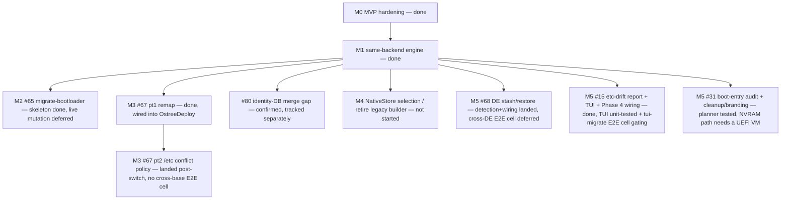

Status date: 2026-08-27. Living document; the issue tracker is authoritative
for day-to-day state, this file is authoritative for **shape and sequence**.

Caveat on that split, recorded because it has already misled readers: five
milestone issues are closed as completed while their exit criteria here are
not met, because the implementation landed and the validation named in the
issue's own scope did not. Where the two disagree, this file is currently the
more accurate. See "Unvalidated paths" below and #186.

## Vision

One engine that moves a bootc system between **images, backends, bootloaders,
base families, and desktops** — safely, with a staged+rollback contract, and
with the same evidence-first discipline at every step: report before acting,
verify after acting, keep the previous state bootable.

Three deliverables share the code:

| Deliverable | What it is | Stability contract |
|---|---|---|
| `bootc-migrate` | The proven OSTree→ComposeFS migrator (**protected MVP**) | CLI surface, output, and behavior frozen; its four E2E cells are untouchable regression gates |
| `bootc-migrate-core` | The capability library: phases, preflight, /etc merge, transaction, registry streaming, stores, scan, remap, boot audit, DE stash/restore | Additive growth; everything new lands here first |
| `bootc-rebase` | The universal CLI: routing table × strategies | Where new user-facing capability ships |

## Where we are

**M0 (MVP hardening) and M1 (same-backend re-base engine) are done.** Every
issue under both milestones is closed. `bootc-rebase` truthfully routes all
four backend pairs (implemented for three of them; `composefs→ostree` remains
explicitly refused, not silently attempted) and the capability scan (#24)
covers every proposed probe.

**In progress, with an explicit boundary between what's landed and what's
deliberately deferred** — each of M2, M3, and M5 shipped a pure/unit-testable
"skeleton" slice first. M2 stopped there, ahead of boot-critical live-system
mutation CI cannot validate; M3 and M5 have since grown their live halves,
but those run on paths no CI cell reaches (no cross-base E2E cell, no NVRAM
mutation; the TUI-assertions gap now has headless render/state tests plus
the `tui-migrate` cell, which is now gating and green), so they are
landed-but-unproven rather than done. See each milestone below for the specific line and why.

## Next release gate — first post-rename release

The next release is a trust checkpoint, not a date-only cut. It must restore
one coherent public identity after the repository and binary rename while
keeping the protected migrator's proven contract distinct from the broader,
partly unvalidated re-base engine.

Before tagging, the release owner must record these decisions and evidence:

- **Identity:** Cargo workspace/crate versions, changelog heading, Git tag,
  binary names, archive names, and container tags agree. The published quick
  start downloads those exact artifacts; no pre-rename
  `bootc-migrate-composefs` path remains in the primary install flow.
- **Scope:** release notes state whether `bootc-rebase` is excluded, included
  as an experimental preview, or supported. Experimental routes must not
  inherit the protected MVP's stability language.
- **Validation:** all protected-MVP E2E cells pass on the release commit, and
  a manual dispatch of the release workflow successfully builds both target
  archives and the container without publishing them.
- **Safety boundary:** release notes enumerate every live or interactive path
  that lacks automated coverage (including cross-base, cross-DE, NVRAM, and
  checklist paths) and link to recovery/undo guidance.
- **Ownership:** one named release owner and target date are attached to the
  roadmap issue; the owner verifies checksums and install commands from the
  immutable GitHub Release before announcing it.

This gate deliberately does not require unfinished M2–M5 work to graduate.
It allows the proven, renamed migrator to ship while making the newer engine's
evidence level visible to adopters. After this release, cadence and the
`bootc-rebase` graduation gate should be tracked separately.

## Unvalidated paths (single list for release notes)

Consumed by [RELEASING.md](https://github.com/tuna-os/bootc-migrate/blob/main/RELEASING.md), which records the release contract
(#171): what ships, how versions are chosen, and the pre-tag checklist.

The next release gate requires enumerating "every live or interactive path
that lacks automated coverage". Assembling that from five milestone
narratives is error-prone, so it is collected here. #186 tracks the fact that
each of these had its implementation issue closed as completed while the
validation named in that issue's own scope never shipped.

| Path | State | Validation gap | Tracking |
|---|---|---|---|
| `migrate-bootloader` live GRUB2→sd-boot | `run` refuses "not implemented"; PR #115 open | no cell installs a GRUB2 guest and flips it | #65, #189 |
| Boot-entry cleanup (`efibootmgr` executor) | implemented, dry-run default, typed confirmation, NVRAM snapshot + `--undo` | live rename + snapshot restore run in the gating OSTree re-base cell; real-hardware validation remains advisable | #31, #189, #204 |
| Cross-base remap + `/etc` conflict policy | implemented, wired into `OstreeDeploy` | never executes; currently un-coverable in CI — the guest cannot scan the target, so the gate no-ops (#191) | #67, #187, #191 |
| DE stash/restore (`--de-migrate`) | implemented, detection table-tested | the non-gating Bluefin→Aurora cell passes `--de-migrate` and asserts the stash; evidence depends on the exploratory cell and target registry scan succeeding | #68, #188 |
| Identity-DB merge across bases | **gap, not closed** — `etc_conflict` holds identity DBs exempt | needs upstream change or compensating logic; the `#80` advisory also silently no-ops in CI for the same scan failure (#191) | #80, #191 |
| `NativeStore` (`composefs-native`) | behind a feature flag, off by default | default path still pins a legacy-CLI builder | #13 |

Everything not in this table — the OSTree→ComposeFS migrator itself, including
rollback and commit — is covered by the seven-cell E2E matrix.

## Milestones

### M0 — MVP hardening (continuous; protects everything else) — **done**

All exit-criteria issues closed: #72 (cfs CLI drift, resolved short-term by
probe+delegation, long-term by #13's `NativeStore`), #22 (E2E rollback proof),
#26 (`rollback` subcommand), #25 (`commit` verified fresh-install-identical),
#17 (post-migration `/var` cleanup), #27 (sleep inhibitor), #18 (pre-baked SSH
E2E image), #12 (phase-module unit tests), #29 (Containerfile-initrd
alternative — evaluated and superseded by the shipped host-side dracut
`--rebuild` approach, closed as won't-implement).

**Exit criteria met**: rollback proven in CI; commit/undo produce
indistinguishable-from-fresh layouts; no known MVP flakes.

### M1 — Same-backend re-base engine (scenarios A / A′) — **done**

#63 (ostree-rebase E2E cell), #64 (`Strategy::OstreeDeploy`), #66
(`Strategy::ImageSwap`), #24 (capability scan: parsers, registry fetch wiring,
`bootc-rebase scan` subcommand, and the `Compatible: YES/NO` gate) — all
closed.

**Exit criteria met**: `bootc-rebase --plan` truthfully answers all four
backend-pair routes; ostree→ostree proven by its own E2E cell; scan output
drives route refusal with evidence.

### M2 — Bootloader migration (scenario B) — **skeleton landed, live mutation deferred**

[#65](https://github.com/tuna-os/bootc-migrate/issues/65) — the
pure core (BLS entry assembly, kernel-arg carry-over, entry-token derivation)
merged and is unit-tested; `bootc-rebase migrate-bootloader` exists as a CLI
shape but its `run` always refuses with "not implemented."

**Why stopped here**: the remaining work — ESP populate, NVRAM cutover via
`efibootmgr` with a `BootNext` one-boot trial before `BootOrder` promotion,
and the kernel-install resync hook (without which a flipped system silently
boots stale kernels after the next update) — is boot-critical and currently
unvalidatable: no E2E cell exercises it yet, and this isn't something a
compile+unit-test loop can prove correct. A full implementation plan (ESP
layout, NVRAM sequencing, resync-hook mechanism, phase-5 interplay, E2E cell
design) is posted on the issue for whoever picks it up with real
E2E-iteration budget and explicit sign-off on the risk.

**Exit criteria (not yet met)**: a GRUB2 bluefin VM re-bases, boots via
sd-boot, survives a kernel update, and `--undo` restores GRUB cleanly.

### M3 — Cross-base re-base (scenario C) — **both parts landed, neither exercised by CI**

[#67](https://github.com/tuna-os/bootc-migrate/issues/67) part 1
(remap planner + apply walk over the staged deployment) is done and wired
into `OstreeDeploy`, gated by `is_cross_base` + `--accept-cross-base`.

Part 2 (the cross-base `/etc` conflict policy) was previously recorded here
as *blocked*: `OstreeDeploy` and `ImageSwap` delegate `/etc` merging to
`bootc switch`, not to `mergetc`, so there was no caller for a `mergetc`
cross-base extension. That is still true of `mergetc` — and it turned out to
be the wrong question. The blocker was stated in terms of the *call site*;
the *inputs* were never missing. `bootc switch` stages without rebooting, so
afterwards the source's defaults (`<booted>/usr/etc`), the user's live
`/etc`, and the target's defaults (`<staged>/usr/etc`) all still sit on disk
beside the merge's own output (`<staged>/etc`).

So the policy landed as `bootc-migrate-core::etc_conflict`: a narrow
**post-merge reconciliation pass**, not a second merge. It rewrites only the
paths where all three inputs disagree — the conflict class the native merge
cannot reason about, because within one base lineage "keep the user's value"
is the right answer and across two it is not — and leaves every other path
exactly as `bootc switch` produced it. Target defaults win; the displaced
value is preserved as a `.rebase-old` sidecar (the same convention #15
introduced in `mergetc`); machine-describing paths and the identity DBs are
reported but never replaced. This is the same "adjust the staged deployment
before first boot" seam part 1's remap already uses.

**What is not proven**: neither part 1 nor part 2 executes in CI at all. Both
are unit-tested (planning, exemptions, sidecar naming, report/JSON, and a
collect→plan→apply round trip over real trees) and neither has run on a real
cross-base system.

Why, precisely — this went through two wrong explanations before the code
was actually read, so the reasoning is recorded rather than the conclusion
alone:

- `is_cross_base` (`scan.rs`) is **lineage-aware**: it returns false when
  either side's `ID_LIKE` contains the other's `ID`. CentOS declares
  `ID_LIKE="rhel fedora"`, so a CentOS → Fedora re-base is same-lineage *by
  design* — see the `cross_base_same_family_via_id_like_is_clean` test. So
  "every cell is Fedora-family → Fedora-family" is substantively right, and
  Bluefin LTS being CentOS Stream 10-based does not by itself make a cell
  cross-base. (An earlier revision of this file claimed otherwise; that was
  wrong.)
- Separately, the three `bluefin:lts` cells run
  `E2E_MODE=composefs-migrate` — the MVP binary, which merges via `mergetc`
  and has no `is_cross_base` gate at all — and no cell passes
  `--accept-cross-base`.
- And when a cell was actually built to exercise this (#187), it uncovered a
  third blocker that outranks both: inside the E2E guest the target-image
  scan cannot reach ghcr.io, so `gate_cross_base` degrades to a no-op with
  only a warning and `is_cross_base` is never evaluated at all (#191).

So the honest status is that the cross-base path is not merely uncovered but
currently **un-coverable in CI**, and the first question is #191, not the
cell. Whether any available image pair even qualifies as cross-base under the
`ID_LIKE` rule is still open. Tracked as #187.

Related: [#80](https://github.com/tuna-os/bootc-migrate/issues/80)
confirmed (via reading ostree's `merge_configuration_from()` source directly)
that `bootc switch`'s native merge does plain whole-*file* 3-way merge with
**no** identity-DB (`passwd`/`group`/etc.) key-level reconciliation — the
exact class of problem `mergetc`'s union-merge exists to prevent. The
`etc_conflict` pass deliberately does **not** close that gap: it holds the
identity DBs exempt (it has no union-merge to rescue them either) and keeps
the existing advisory warning. #80 still needs either an upstream
ostree/bootc change or its own compensating logic.

**Exit criteria (not yet met)**: fedora-family → centos-family E2E cell with
a populated `/var`: correct ownership after reboot, report lists every
renumbered account, `.rebase-old` sidecars present where defaults were taken.

### M4 — Native store & the generation matrix (the #72 endgame) — **not started beyond the feature flag**

[#13](https://github.com/tuna-os/bootc-migrate/issues/13)'s
`NativeStore` (composefs/composefs-oci crates, no CLI shelling) exists behind
the `composefs-native` feature flag and is off by default. The default path
still probes host/target/builder for a legacy-CLI-capable bootc and pins
`quay.io/fedora/fedora-bootc:42` as a builder when none of the three has it —
visible in every E2E run's Phase 2 log line. Store **selection** by target
generation, and retiring the pinned legacy builder, have not been picked up.

**Exit criteria (not yet met)**: migration succeeds with *no* legacy-CLI
bootc anywhere (host, target, builder); `BMC_CFS_BUILDER` becomes a no-op
escape hatch.

### M5 — Desktop & UX (scenario E + human factors) — **computable cores landed; interactive/live coverage is partial**

Three issues share the same shape: the pure/reusable core shipped first and
is unit-tested. The interactive checklist in #15 is now driven through a
full migration by the gating TUI cell. The gating OSTree re-base cell also
executes #31's live NVRAM rename and snapshot restore against OVMF and asserts
that `efibootmgr -v` is byte-identical afterwards. That evidence does not
cover #65's unimplemented bootloader flip, and real-hardware validation is
still advisable before treating firmware-specific behavior as universal.

- [#68](https://github.com/tuna-os/bootc-migrate/issues/68) — DE
  config stash/restore (GNOME dconf/gnome-shell, KDE kdeglobals/plasma,
  COSMIC, niri, XFCE), a best-effort portable-preference extractor, and the
  `pre-switch.d`/`post-switch.d` hook contract are done, unit-tested, and
  exposed as `bootc-rebase de-migrate stash|restore`. Target-image DE
  detection now streams session files, session binaries, and any
  display-manager default session out of the registry (`de_detect`), the
  same decision function classifies the running host, and `rebase
  --de-migrate` (off by default) stashes every human account's outgoing DE
  config before staging and restores a matching stash on the way back. The
  decision logic is table-driven-tested offline; what has *not* run is a
  cross-DE E2E cell (Bluefin GNOME → an Aurora/KDE image) asserting the
  stash exists on a real system and survives the reboot — that and the
  portable subset actually being applied by a hook still need live
  validation.
- [#15](https://github.com/tuna-os/bootc-migrate/issues/15) — the
  factory-vs-live `/etc` diff computation is done, exposed as
  `bootc-migrate etc-drift` (table or JSON). The interactive checklist UI
  (`etc-drift --interactive`, or `--review-drift` as "Phase 0.5" ahead of a
  live migration) and its wiring into Phase 4's merge decision
  (`EtcDriftManifest` / `merge_etc_files_with_overrides`, unit-tested) are
  now implemented. The checklist's terminal event loop — previously the
  one piece only manual/corral-VM validation could reach — is now covered
  twice over: headless state-machine + `TestBackend` render tests
  (`drift_review::tests`, and `tui::tests` for the migration wizard), and
  the `tui-migrate` E2E cell, which drives the checklist and then a full
  migration through the wizard on a pty inside the VM
  (`tests/tui-e2e-driver.py`; see docs/testing.md "TUI testing"). The
  cell is gating as of 2026-08-27 and publishes an asciicast/GIF/screenshot
  walkthrough artifact on every run. The full seven-cell matrix runs on
  GitHub-hosted runners (run 33071608765, all green).
- [#31](https://github.com/tuna-os/bootc-migrate/issues/31) — the
  UEFI boot-entry audit (dead/generic-label/duplicate/firmware-managed
  classification) is done, read-only, exposed as `bootc-rebase boot-entries`.
  Interactive selection, live entry removal, and branding-rename are now
  implemented too, taken on with explicit sign-off on the NVRAM-mutation
  risk rather than deferred again. The split follows the mitigation below:
  the whole decision — which entries may be deleted or renamed, and which
  refusals stop a plan — is a pure, table-tested planner
  (`boot_cleanup::plan`), and the `efibootmgr` executor
  (`boot_cleanup::live`) only performs what the planner approved. Dry-run
  is the default; `--apply` requires a typed confirmation and writes a
  restorable NVRAM snapshot first; `--undo` replays it. The gating OSTree
  re-base cell now covers the create-before-delete rename and `--undo`
  against live OVMF variables, including a byte-for-byte restoration check.
  Entry deletion and the checklist's terminal event loop are not exercised
  by that flow and still need targeted VM or real-hardware validation.

**Exit criteria (not yet met)**: bluefin↔aurora-style switch preserves user
data untouched, stashes/restores DE state, swaps DE-scoped flatpaks on
request; non-experts can read what will happen before it happens.

### Deferred extensions (raised on #30, not yet scoped into a milestone)

Two directions came up in discussion on the [generalize-into-a-re-base-engine
RFC](https://github.com/tuna-os/bootc-migrate/issues/30) but never
got a milestone or an issue. Recorded here so they aren't lost, not because
either is imminent:

- **`composefs→ostree` (reverse backend switch)** — going back to an
  OSTree-backed image from a composefs system that never had an OSTree
  deployment. `bootc-rebase`'s routing table currently refuses this route
  explicitly (see M1 above) rather than attempting it; `undo` only reverts a
  migration this tool itself performed, which is a much narrower problem
  (the prior OSTree deployment is already on disk). A general
  `composefs→ostree` route needs to initialize an OSTree repo and bootstrap a
  deployment from a pulled image with nothing to restore from — mechanically
  the inverse of `Strategy::OstreeDeploy` (M1), not a variant of it.
- **Cross-family re-base (Fedora ↔ Ubuntu ↔ Arch)** — M3's cross-base work
  (#67) stays within the Fedora family, where `/etc` defaults, UID/GID
  allocation, and the init/PAM stack share lineage. A cross-family route
  would need to treat most of `/etc` as non-mergeable (drop rather than
  3-way-merge family-specific package-manager and service config), carry
  only universally meaningful state (`/var/home`, containers, flatpaks,
  accounts), and regenerate target-family defaults from scratch — closer to
  a "reinstall with data preservation" than an in-place migration.

### 1.0 — Universal migrator

All routes in the table implemented or explicitly refused with evidence;
MVP binary either retired into `bootc-rebase --target-backend composefs`
or kept as a thin alias; docs complete (architecture, generations,
recovery, hooks). Version and deprecation policy published.

## Dependency graph

## Risks & standing mitigations

- **Upstream drift is the norm, not the exception.** bootc replaced its cfs
  CLI once mid-project; assume it will again. Mitigation: the generation
  matrix (probe, delegate, native), pinned-builder escape hatch, and the
  empirical harness in docs/cfs-cli-generations.md to re-verify fast.
- **MVP regression via shared code.** Mitigation: MVP protection rule
  (frozen behavior, additive-only in core, probe-gated divergence), four
  untouchable E2E cells.
- **Boot-critical work can't be validated by this project's normal loop.**
  Mitigation, applied consistently across M2 and M5: land the pure/testable
  core, stop before live NVRAM/ESP/interactive-UI mutation, document the
  exact remaining plan on the issue, and require explicit sign-off + a
  dedicated E2E cell before attempting it — rather than shipping unvalidated
  boot-path code just because the rest of a PR's CI run was green.
- **CI capacity.** Runner starvation observed both 2026-07-19 (this repo's
  own concurrency groups) and 2026-07-24 (org-wide GitHub Actions queue
  congestion across most tuna-os repos simultaneously — not fixable from any
  one repo's side; just wait it out or check org Actions capacity/billing).
  Mitigation: everything is verified locally (or via a remote build host)
  before push; heavy validation designed as unit/loopback experiments where
  possible; E2E cells narrow and dispatchable individually.
- **Settings translation temptation (#68).** Prior art is unanimous that
  GNOME↔KDE translation fails; the spec forbids it. Stash/restore only.

## Decision log (summary — details in issues)

- Bootloader on ostree→ostree: migrate to systemd-boot **when ready** (#64)
- UID/GID divergence: **auto-remap with report** (#67)
- Cross-base /etc conflicts: **target defaults win**, user value kept as
  `.rebase-old` sidecar (#67, part 2 — landed as
  `bootc-migrate-core::etc_conflict`, see M3 above; not yet exercised by a
  cross-base E2E cell)
- Store format is defined by the **reader at boot** (target image) — writer
  selection follows the target's generation (#13/#72)
- XBOOTLDR GUID-retype: **dead** (sd-boot ≥258.2 requires vfat) — ESP-copy
  + resync instead (#65)
- DE settings: **stash/restore, never translate** (#68)
- Boot-critical or UI-only remaining scope gets a documented plan on its
  issue, not a best-effort implementation without validation (#65, #31, #15)
- When boot-critical scope *is* taken on (#31's cleanup): split the
  decision from the execution, so every safety rule is a pure unit test and
  the executor holds no policy; back up before mutating; make the
  destructive step opt-in and human-gated; and never remove the path back
  to a bootable state (#31)
