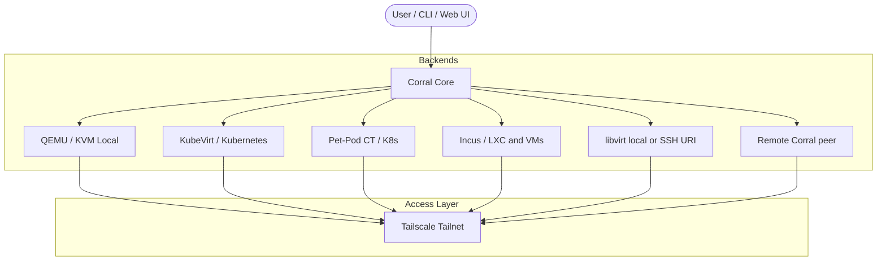

Welcome to the comprehensive user guide for **Corral** — the unified management platform for virtual machines, pet-pod containers, and local hypervisors.

## Backends, contexts, and peers

`corral config set-default-backend incus` makes unqualified creates use
Incus. `corral context list|set|get` switches Corral's context without
mutating kubectl or the Incus CLI; `--context` is a one-shot override.

Libvirt URIs make remote QEMU a normal backend, for example:
`corral context set qemu+ssh://hypervisor/system`.

A local dashboard can aggregate an in-cluster Corral without a local
kubeconfig: `corral peer add homelab https://corral.example.ts.net`.
Console routing tries the VM's advertised direct address first and relays
through the peer only when direct access is unavailable.

---

## 1. Overview & Architecture

Corral brings together diverse virtualization and container workloads under a single interface, CLI, and Tailscale network.



### Supported Compute Backends

| Backend | Scope | Tech Stack | Use Case |
|---|---|---|---|
| **QEMU** | Local Host | QEMU / KVM + systemd | Fast, local ephemeral or dev VMs on your workstation |
| **KubeVirt** | Cluster | KubeVirt + Kubernetes | Production VMs with live migration, PVC storage, and scaling |
| **Container (CT)** | Cluster | Kubernetes Pod + PVC | "Pet Pods" — persistent Linux containers (Distrobox on K8s) |
| **Incus** | Local or remote | Incus remote | Containers and VMs managed through existing Incus trust |
| **libvirt** | Local or remote | libvirt URI / OpenSSH | Existing domains and remote QEMU hypervisors |

---

## 2. Interactive Interfaces

### Web Dashboard

Access the Proxmox-style Web UI at `http://localhost:8006` or via `corral web`.


#### Features:
- **Datacenter Tree**: Navigate through all VMs, CTs, and Incus instances across local and cluster nodes.
- **Live CPU & Memory Sparklines**: Real-time load monitoring per VM.
- **Tag Filtering**: Filter instances by custom tags (`prod`, `dev`, `desktop`).
- **Mobile Responsive**: Manage your VM fleet from your mobile browser.
- **Theme & Branding**: Customize accent colours, header branding, and inject custom CSS — via CLI flags, config file, or the built-in Settings page.


#### Theme & Branding

Corral's web UI accent colour, header branding, and custom CSS are fully
customizable — no source-code changes needed.

**CLI flags** (highest priority, override everything):
```bash
corral web --accent \"#3b82f6\" --brand-title \"My Lab\" --brand-emoji \"⚡\" --brand-subtitle \"Engineering\"
```

**Config file** (`~/.config/corral/config.yaml`, loaded on startup):
```yaml
web:
  accent: \"#22c55e\"        # CSS hex colour
  accent_2: \"#16a34a\"      # hover/active variant
  brand_title: \"My Lab\"
  brand_emoji: \"⚡\"
  brand_subtitle: \"Engineering\"
  custom_css: |
    .btn.primary { border-radius: 20px; }
    .card { background: var(--panel-2); }
```

**Settings page** (web UI → Settings in the sidebar):
- Colour picker with preset swatches (Orange, Blue, Green, Purple, Red, Amber)
- Brand title, emoji, and subtitle fields with live header preview
- Custom CSS textarea that injects styles immediately as you type
- Save button persists to `config.yaml`

Precedence: CLI flags > config.yaml > built-in defaults (🤠 Corral, orange
accent).

---

### Terminal UI (TUI)

Launch the interactive Bubble Tea TUI by running `corral` with no arguments (or explore in demo mode with `corral --demo`).


The left side is a unified, searchable fleet. Wide terminals add a details
pane with canonical ID, backend/context, placement, address, resources, and
available operations. Failed remotes appear as partial-fleet warnings without
hiding healthy instances.

#### TUI keyboard shortcuts and features

- `/` fuzzy-searches names, canonical IDs, backends, contexts, nodes, and IPs.
- `Tab`, `[` and `]` cycle between the complete fleet and named contexts.
- `Enter` opens a capability-aware action menu; unsupported operations are
  absent rather than failing after selection.
- `s` and `x` quickly start or stop the selected VM; `r` refreshes every
  backend.
- `d` runs scoped QEMU, KubeVirt, Incus, and libvirt diagnostics.
- `?` opens the in-app command deck.
- QEMU, KubeVirt, Incus, libvirt, and pet-pod CTs share the inventory without
  losing their backend-specific capabilities.

---

## 3. Core Feature Walkthrough

### 1. Instance Lifecycle Management

Create and manage instances across any backend with identical commands:

```bash
# Create local QEMU VM
corral create dev-vm --iso https://example.com/ubuntu.iso --disk 40G

# Create KubeVirt cluster VM
corral create prod-vm --kubevirt --image fedora

# Create on an existing Incus remote
corral create fast-ct --backend incus --context lab --image images:ubuntu/22.04

# Universal operations
corral start dev-vm
corral stop dev-vm
corral delete dev-vm
```

---

### 2. Remote Access: VNC, RDP & TTY

Corral provides single-command remote access to guest displays and shells:

#### In-Browser & Local VNC


- **VNC Display**: `corral viewer <vm-name>` opens a VNC session. In the Web UI, `noVNC` provides zero-install browser display access.
- **Interactive TTY / SSH**: `corral ssh <vm-name>` or `corral tty <ct-name>` connects your terminal directly into guest shell namespaces (via SSH, `virtctl console`, or `incus exec`).


---

### 3. Bootable Container Images (`bootc`)

Boot containers directly as VMs using the `bootc` plugin:

```bash
corral plugin install bootc
corral bootc create my-node --image quay.io/centos-bootc/centos-bootc:stream9
```

- Builds a bootable OS disk on-cluster using `bootc install to-disk`.
- Upgrade guest OS images using `corral bootc upgrade <vm-name>`.

---

### 4. Proxmox VE API Compatibility Layer

Corral includes a Proxmox VE REST API emulation layer (`/api2/json/...`), allowing Terraform (`bpg/proxmox`), Ansible, and Proxmoxer tools to manage KubeVirt and Incus instances natively.

```bash
corral plugin install proxmox
corral proxmox serve --addr :8006
```

---

### 5. Plugin Marketplace

Expand Corral with lightweight marketplace plugins:

```bash
# Browse marketplace
corral plugin search

# Installed plugins
corral plugin list

# Plugin management
corral plugin install <name>
corral plugin remove <name>
```

#### Available Plugins:
- `bootc`: Bootable container image VM builder.
- `proxmox`: Proxmox VE REST API compatibility server.
- `backup`: S3/R2 VM disk backup & restore.
- `snapsched`: Automated VM snapshot schedules with retention rules.
- `schedule`: VM autostart and shutdown cron windows.
- `gpu`: GPU / PCI passthrough device plugin discovery.
- `windows`: First-class Windows VM creation (UEFI, TPM, virtio drivers).
- `vdi`: Virtual Desktop Infrastructure desktop pools.

---

## 4. Diagnostics & Troubleshooting

Run `corral doctor` to diagnose cluster capabilities, hypervisor support, and storage drivers:

```bash
corral doctor
```

In a multi-context setup it diagnoses every configured QEMU, KubeVirt, Incus,
and libvirt target. Use `corral doctor --context NAME` for one target. The
complete capability matrix and direct-versus-relayed networking behavior are
documented in [backend-support.md](https://github.com/tuna-os/corral/blob/main/backend-support.md).

```
✓ KubeVirt installed (v1.8.2)
✓ CDI containerized data importer available
✓ Default StorageClass supports volume expansion
✓ VolumeSnapshotClass available for backups
✓ QEMU KVM hardware acceleration (/dev/kvm) accessible
✓ Incus daemon socket (/var/lib/incus/unix.socket) active
```

## Reproducible screenshots

Documentation captures use the real built-in demo fleet. They are automated
for both Chromium and the Bubble Tea TUI:

```bash
npm install --prefix e2e
node scripts/capture-docs.mjs docs/screenshots/generated
```

The same command can target the TunaOS site checkout:
`node scripts/capture-docs.mjs ../docs/static/img/screenshots/corral`.
