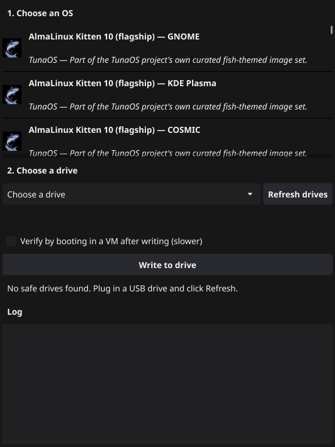
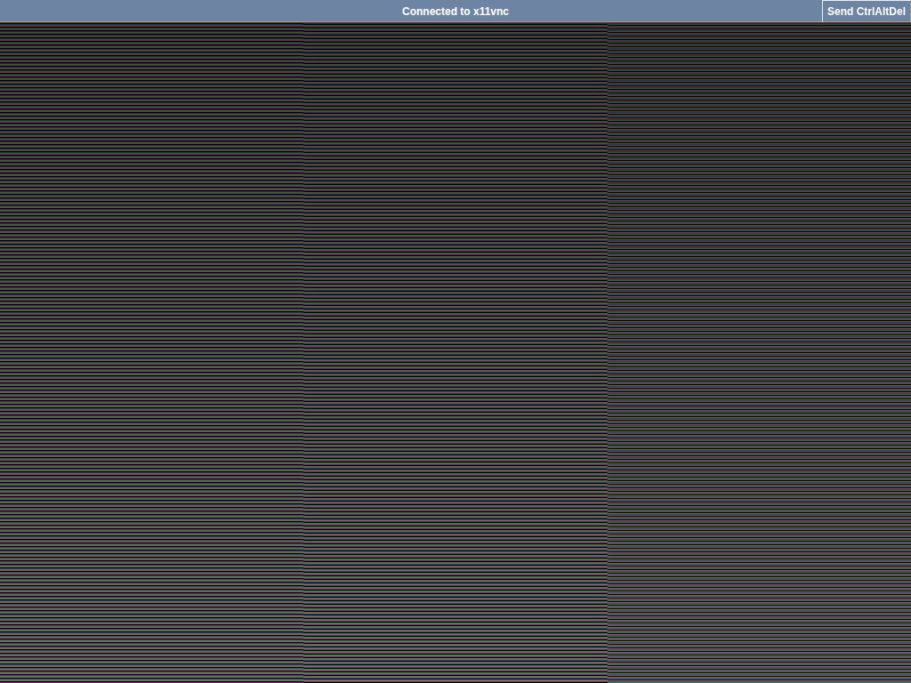

:::tip[Try it]
Grab the latest build from the [tuna-os/iso-builder releases](https://github.com/tuna-os/iso-builder/releases) page. See the [User Guide](/docs/iso-builder/native/user-guide) for a full walkthrough.
:::

> ⚠️ **Alpha** — unsigned builds, interfaces below will change. See [Known limits](#known-limits).

A cross-platform desktop app — **Linux, macOS, and Windows** — that writes
a real bootc image straight to a USB drive using
[tacklebox](https://github.com/tuna-os/tacklebox), no browser sandbox
involved. This is the un-hacky alternative to Ventoy: instead of
chainloading arbitrary ISO files, it installs a real bootable environment
onto a **persistent, extendable multi-boot drive** — plug the same stick
back in later and *add* another OS, *update* one in place, or *remove*
one to reclaim space, all without reformatting.

## Why not just burn an ISO?

An ISO burner is one-shot: write it, and the drive is now exactly one OS,
forever, until you erase it and start over. This app instead manages the
drive the way a package manager manages packages:

- **Plug in a USB drive.** The app detects whether it's blank or already
  has TunaOS environments on it, and defaults accordingly — "Write to
  drive" for a blank stick, "Add to drive" for one it recognizes.
- **Pick from the real curated catalog** — the same variants the browser
  [ISO Builder](/docs/iso-builder) offers, across GNOME, KDE Plasma, COSMIC, Niri, and
  XFCE.

  

- **Day-2 lifecycle, not just day-1.** Once a drive is managed, a
  "Manage this drive" panel appears with **Verify**, **Update**, and
  **Remove** — the same primitives `tacklebox`'s CLI exposes, wrapped in
  a GUI a non-technical user can actually drive.
- **Optional boot verification.** Tick "Verify by booting in a VM after
  writing" (Linux only for now) and the app boots the freshly-written
  drive in a throwaway QEMU VM to confirm it actually reaches userspace,
  instead of trusting a zero exit code alone.
- **Debug view into macOS's helper VM.** Its write path boots a
  headless VM behind the scenes — click "View VM console (debug)"
  while an operation is running to see its actual screen in your
  browser via a bundled [noVNC](https://novnc.com) client, for the rare
  case something goes wrong in a way SSH-streamed logs don't capture.

  

## How it actually writes the drive, per platform

`bootc install` needs real Linux kernel semantics — ostree, composefs,
`chattr +i` immutable bits — that don't exist natively everywhere:

| Platform | How it gets a real Linux kernel |
|---|---|
| **Linux** | Already has one. Runs `tacklebox` directly. |
| **macOS** | Boots a small, ephemeral QEMU VM (downloaded once, cached after), attaches the USB drive to it as a virtio block device, and runs `tacklebox` inside. |
| **Windows** | Uses WSL2 (a real, Microsoft-maintained Linux kernel already built into Windows 10 2004+/11) plus [usbipd-win](https://github.com/dorssel/usbipd-win) to attach the USB drive into it. |

Missing prerequisite (WSL2, QEMU, usbipd-win)? The app detects it and
offers a one-click install rather than a dead-end error — this tool is
built for people who don't want to open a terminal.

## Known limits

- **Unsigned builds.** macOS needs a right-click → Open the first time
  (Gatekeeper); Windows needs "More info" → "Run anyway" (SmartScreen).
  Proper code signing is planned once there's a real release channel.
- **Boot verification is Linux-only.** macOS and Windows already run the
  write itself inside a VM/WSL2; nesting a second VM boot-check inside
  that isn't supported yet.
- **Windows and macOS pay a real first-use cost.** Booting the helper VM
  (macOS) or attaching via WSL2 (Windows) takes real time compared to
  Linux's direct path — worth it for the same drive-management
  capabilities everywhere, but not instant.

## Source

Part of [tuna-os/iso-builder](https://github.com/tuna-os/iso-builder)
(`native/`) — built on [tacklebox](https://github.com/tuna-os/tacklebox),
the same engine behind the browser [ISO Builder](/docs/iso-builder) and TunaOS's own
release media.

*Part of the [Tuna OS](https://github.com/tuna-os) ecosystem.*
