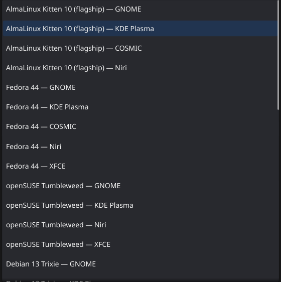
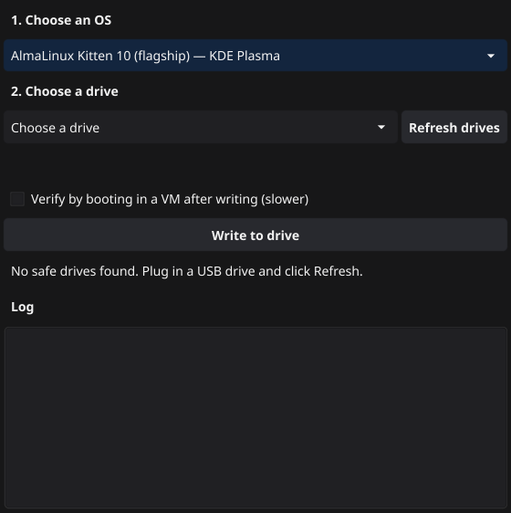

# Native App User Guide

Step-by-step walkthrough of writing and managing a multi-boot USB drive
with the [native cross-platform app](/docs/iso-builder/native). See that page for the
high-level pitch; this page is the how-to.

> Screenshots below are generated automatically by
> [`native/e2e/walkthrough.sh`](https://github.com/tuna-os/iso-builder/blob/main/native/e2e/walkthrough.sh)
> — a virtual X server drives the real app and captures its actual
> rendered output, the same "regenerate on change" approach the browser
> [ISO Builder's walkthrough](/docs/iso-builder#quick-start) uses. If the app changes,
> rerun it and commit the refreshed images.

## 1. Install

Grab the build for your platform from the
[tuna-os/iso-builder releases](https://github.com/tuna-os/iso-builder/releases) page:

- **Linux**: a plain binary. Needs a `tacklebox` binary reachable on
  `PATH`, or placed next to the app.
- **macOS**: `TunaOS ISO Builder.app`. Unsigned for now — right-click →
  **Open** the first time to get past Gatekeeper (see the [note on
  signing](/docs/iso-builder/native#known-limits)).
- **Windows**: `tacklebox-app.exe`. Unsigned for now — click **More
  info** → **Run anyway** on the SmartScreen prompt.

The app doesn't assume anything else is pre-installed. If it needs WSL2
(Windows) or QEMU (macOS) and doesn't find them, it'll say so and offer
to install them for you — see [Prerequisite prompts](#prerequisite-prompts)
below.

## 2. Choose an OS

Open the app. The **1. Choose an OS** dropdown lists the same curated
catalog the browser [ISO Builder](/docs/iso-builder) offers — real TunaOS variants
across every desktop TunaOS ships.

Pick one. The dropdown collapses to show your selection:

## 3. Choose a drive

Plug in the USB drive you want to use, then click **Refresh drives** if
it doesn't show up automatically. The dropdown only ever lists drives
the app's safety filter considers genuinely safe to write to — internal
disks, mounted system volumes, and anything that isn't removable media
are excluded before they can even be selected. (On Linux this is real
`lsblk` output filtered in Go, unit-tested against real-hardware
fixtures — same approach on macOS via `diskutil`/`DiskArbitration` and
Windows via `Win32_DiskDrive`.)

Selecting a drive tells you immediately what the app is about to do:

- **Blank or unrecognized drive** — "Blank drive — writing will erase
  everything on it." The button reads **Write to drive**, and clicking
  it asks for an explicit confirmation before erasing anything.
- **Already has TunaOS on it** — the app runs a quick status check and,
  if it finds an existing managed drive, shows what's installed. The
  button switches to **Add to drive**, and no destructive confirmation
  is needed — adding an environment to a drive you're already managing
  isn't the same risk as erasing a stranger's disk.

## 4. (Optional) Verify by booting

Linux only, for now. Tick **Verify by booting in a VM after writing**
before you write or update, and once the operation finishes the app
boots the drive in a throwaway QEMU VM and watches its serial console
for a real sign of life (a login prompt, a systemd unit finishing
cleanly) before calling the operation done. If the VM hits a kernel
panic or never gets there, you'll see that instead of a false "success."

This costs real time — a full VM boot, on top of the write itself — so
it's opt-in rather than the default.

## 5. Write

Click **Write to drive** (or **Add to drive**). Progress streams into
the **Log** panel at the bottom as it happens — this is the actual
output of the underlying `tacklebox` run, not a synthetic progress bar.

## 6. Managing a drive you've already written

Plug the drive back in later (on any of the three platforms — the drive
itself isn't tied to whichever machine wrote it) and select it. Since
the app now recognizes it as managed, a **Manage this drive** panel
appears with:

- **Verify** — sanity-checks the drive's integrity (`tacklebox verify`)
  without touching anything.
- **Update** — re-installs the currently-selected OS on the drive in
  place, refreshing it to match the current image. Existing environments
  you don't touch are left alone.
- **Remove** — type the environment's id (shown in the Verify/status
  output above the log) and confirm to remove it, reclaiming its space.
  Tacklebox refuses to remove the last environment on a drive rather
  than leave you with unbootable media, and the app surfaces that
  refusal rather than hiding it.

macOS and Windows show the same panel and support the same operations —
checking a drive's status there costs roughly the same VM-boot/WSL2-attach
price as writing to it, since there's no cached `tacklebox` binary
sitting on the drive itself yet. That's a real, undisguised tradeoff on
those two platforms, not a bug.

## Prerequisite prompts

If an operation needs something the app can't find — WSL2 or usbipd-win
on Windows, QEMU on macOS — you'll see a dialog explaining what's
missing and why, with a button to fix it automatically rather than a
dead-end error message and a link to go figure it out yourself. Some
fixes (enabling WSL2's underlying Windows features) require **one
reboot** before they take effect; the app tells you when that's the
case rather than silently failing again on retry.

## Troubleshooting

- **"No safe drives found"** even though a USB stick is plugged in:
  click **Refresh drives**. If it still doesn't appear, the safety
  filter may be correctly excluding it (e.g. it's reporting itself as a
  fixed/internal disk over USB, which some enclosures do) — this is the
  filter working as intended, not a bug to route around.
- **Windows: WSL2 install says it needs a restart** — this is expected
  the first time on a machine that's never had WSL2 enabled. Restart,
  then retry the operation; it'll pick up from there.
- **macOS: first write is slow** — the helper VM's base image downloads
  once and is cached after that; the first run pays that cost, later
  runs don't.
